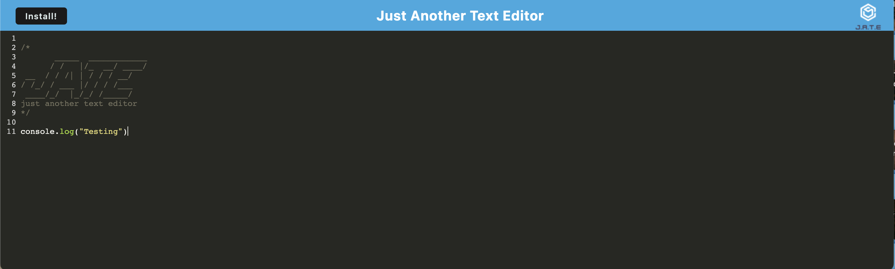

# text-editor

## Description
A text editor that runs in the browser. The app will be a single-page application that meets the PWA criteria. You can create notes or code snippets with or without an internet connection. This application uses a package called idb, which is a lightweight wrapper around the IndexedDB API. It features a number of methods that are useful for storing and retrieving data.

## Usage

[GitHub](https://github.com/Babylex710/text-editor)

## Screenshot

